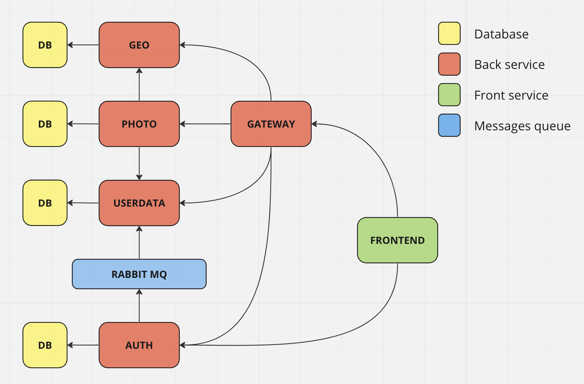
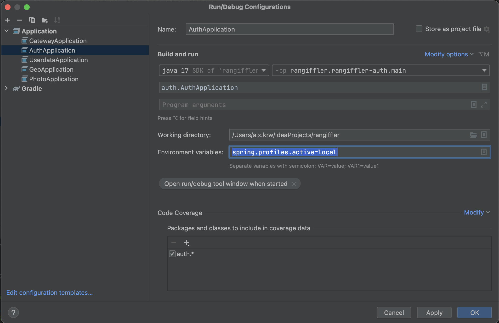

# Rangiffler

Rangiffler - современное, модное и молодежное приложение для хранения ценных воспоминаний (фотографий) со всего мира. 

Социальная сеть будущего, с помощью которой можно отслеживать и проносить через себя эмоции и впечатления ваших дорогих друзей.

Спасибо, что выбрали именно нас! Еще совсем немного - и мы станем №1 и даже обойдем Instagram! Будущее за нами!

# Используемые технологии

- [Spring Authorization Server](https://spring.io/projects/spring-authorization-server)
- [Spring OAuth 2.0 Resource Server](https://docs.spring.io/spring-security/reference/servlet/oauth2/resource-server/index.html)
- [Spring Data JPA](https://spring.io/projects/spring-data-jpa)
- [Spring Web](https://docs.spring.io/spring-framework/docs/current/reference/html/web.html#spring-web)
- [Spring Actuator](https://docs.spring.io/spring-boot/docs/current/reference/html/actuator.html)
- [Spring gRPC](https://yidongnan.github.io/grpc-spring-boot-starter/en/server/getting-started.html)
- [Docker](https://www.docker.com/resources/what-container/)
- [Docker-compose](https://docs.docker.com/compose/)
- [Postgres](https://www.postgresql.org/about/)
- [React](https://ru.reactjs.org/docs/getting-started.html)
- [JUnit 5 (Extensions, Resolvers, etc)](https://junit.org/junit5/docs/current/user-guide/)
- [Allure](https://docs.qameta.io/allure/)
- [Selenide](https://selenide.org/)
- [Java 17](https://www.oracle.com/java/technologies/javase/jdk17-archive-downloads.html)
- [Gradle 7.5.1](https://docs.gradle.org/7.5/release-notes.html)
- И многое другое!

# Архитектура приложения

Приложение Rangiffler построено на основе микросервисной архитектуры, среди звеньев которой можно выделить:
1. **AUTH** - аутентификация и авторизация (*backend*).
2. **GATEWAY** - связывание (прокси) клиента с необходимыми микросервисами (*backend*).
3. **USERDATA** - информация о пользователе: как личные данные, так и список друзей (*backend*).
4. **GEO** - данные о странах мира (*backend*).
5. **PHOTO** - сведения о фотографиях пользователей (*backend*).
6. **FRONTEND** - интерфейс приложения, с которым взаимодействует пользователь (*frontend*). 



# Список портов приложения

|    Сервис    |            Порт            |
|:------------:|:--------------------------:|
|     AUTH     |       9000 (server)        |
|   GATEWAY    |       8080 (server)        |
|   USERDATA   | 9001 (server), 9002 (grpc) |
|     GEO      | 9003 (server), 9004 (grpc) |
|    PHOTO     | 9005 (server), 9006 (grpc) |
|   FRONTEND   |        80 (server)         |

# Запуск приложения локально в IDE

#### 1. Запустить БД командой
```posh
docker run --name all-db -p 5432:5432 -e POSTGRES_PASSWORD=secret -d postgres:15.1
```
#### 2. Подключиться к БД postgres (host: localhost, port: 5432, user: postgres, pass: secret, database name: postgres) и создать пустые БД микросервисов
```sql
create database "auth" with owner postgres;
create database "geo" with owner postgres;
create database "photo" with owner postgres;
create database "userdata" with owner postgres;
```
#### 3. Запустить RabbitMq брокер сообщений:
```posh
docker run --name rabbitmq -p 5672:5672 -p 15672:15672 rabbitmq:3.11-management
```
#### 4. Запустить fronted-сервис
```posh
alx.krw@Aleksandrs-MacBook-Pro rangiffler % cd rangiffler-front
alx.krw@Aleksandrs-MacBook-Pro rangiffler-front % npm i
alx.krw@Aleksandrs-MacBook-Pro rangiffler-front % npm start
```
#### 5. Прописать run конфигурацию для всех backend-сервисов - Active profiles local
Run -> Edit Configurations -> выбрать main класс -> указать Active profiles: local

#### 6. Запустить backend-микросервисы Rangiffler(а) командой Run в IDE в следующем порядке:

*AUTH -> GATEWAY -> USERDATA -> GEO -> PHOTO*


Варианты запуска приложения:
Локально в idea
Локально через docker
(что нужно для этого)

Запуск тестов

Пример отчета

